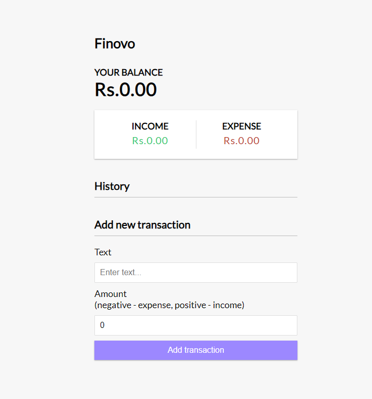
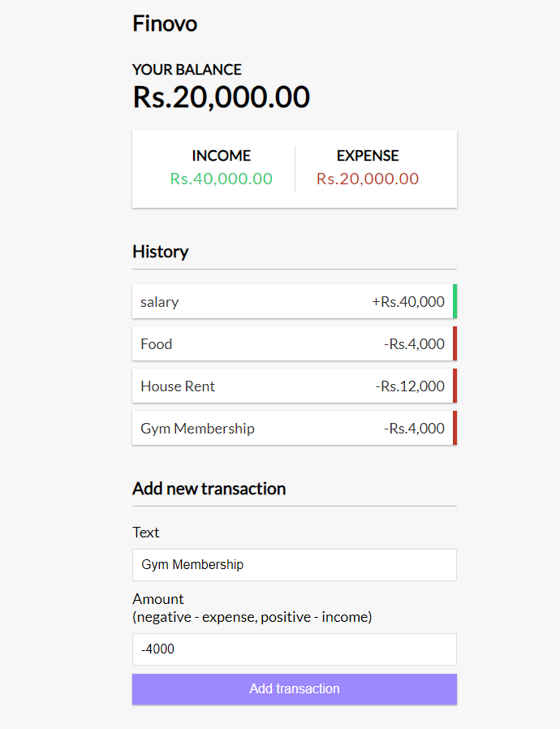
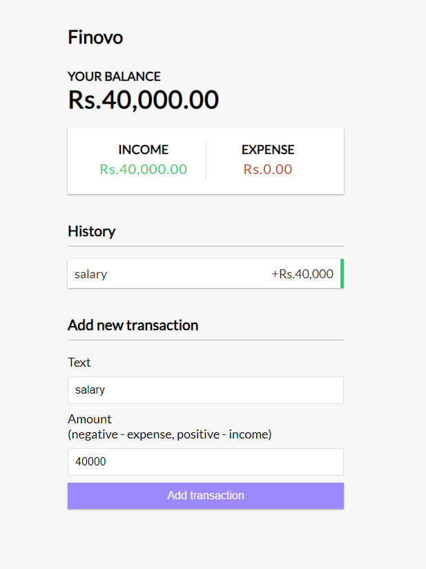

# Finovo 💰

Finovo is a straightforward yet powerful web application designed to help users track their expenses and manage their finances effectively. The application features a distraction-free user interface, enabling users to focus on their financial goals. Developed using the MERN stack, Finovo ensures a smooth and efficient user experience.



## Features

- **Intuitive User Interface**: Designed with simplicity in mind to avoid distractions and provide a seamless experience for users with minimal technical knowledge.
- **Expense Tracking**: Add, view, and delete transaction details with ease.
- **Data Management**: Uses Axios for efficient API calls to the database, performing CRUD operations.
- **MERN Stack Architecture**: Built with MongoDB, Express, React, and Node.js for robust functionality.
- **Performance Optimization**: Lightweight design for fast load times and quick responsiveness.

## Technologies Used

- **React**: JavaScript library for building user interfaces.
- **MongoDB**: NoSQL database for storing transaction details.
- **Express**: Web application framework for Node.js.
- **Node.js**: JavaScript runtime for server-side development.
- **Axios**: Promise-based HTTP client for making API requests.
- **CSS**: For styling the application.
- **Git**: Version control for managing codebase changes.

## Screenshots
Here are some key screenshots of the Finovo app to give you a glimpse of its features:


*Transactions Page*


*Add Transaction*

## Installation

Follow these steps to set up the project locally:

1. **Clone the repository:**
    ```bash
    git clone https://github.com/heyymohit/Finovo.git
    cd Finovo
    ```

2. **Install dependencies:**
    ```bash
    npm install
    ```

3. **Set up the MongoDB database:**  
   Ensure you have MongoDB installed and running. Create a database for storing transaction details.

4. **Start the development server:**
    ```bash
    npm start
    ```

The application should now be running on `http://localhost:3000`.

### Acknowledgements

- [React](https://reactjs.org/): A JavaScript library for building user interfaces.
- [Mongoose](https://mongoosejs.com/): For providing a straightforward way to model MongoDB data.
- [Node.js](https://nodejs.org/): For server-side JavaScript execution.
- [Express](https://expressjs.com/): For building web applications with Node.js.

### Contact

For any inquiries or issues, please contact:

- **Name:** Mohit Agarwal
- **Email:** [mohitagarwal.1031@gmail.com](mailto:your.email@example.com)
- **GitHub:** [heyymohit](https://github.com/heyymohit)
